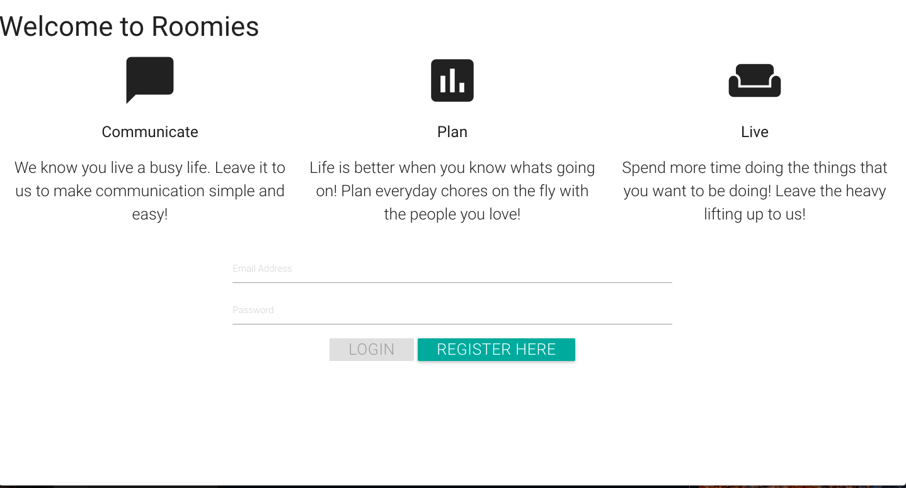
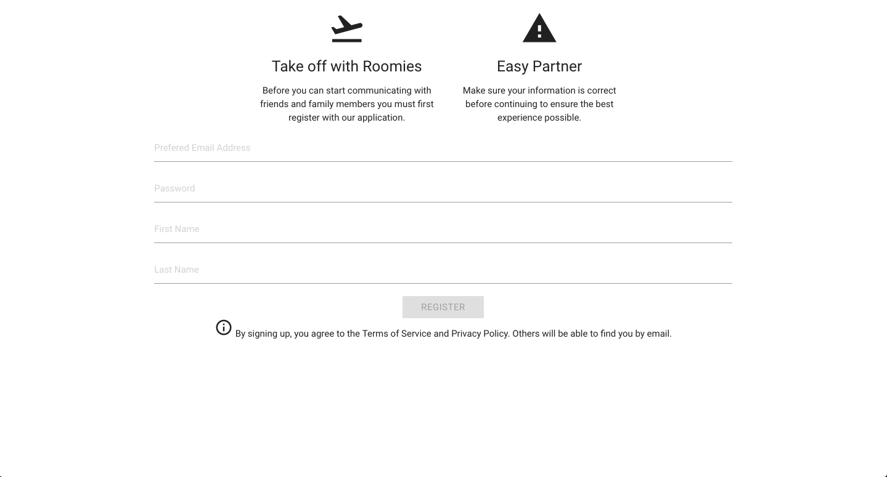
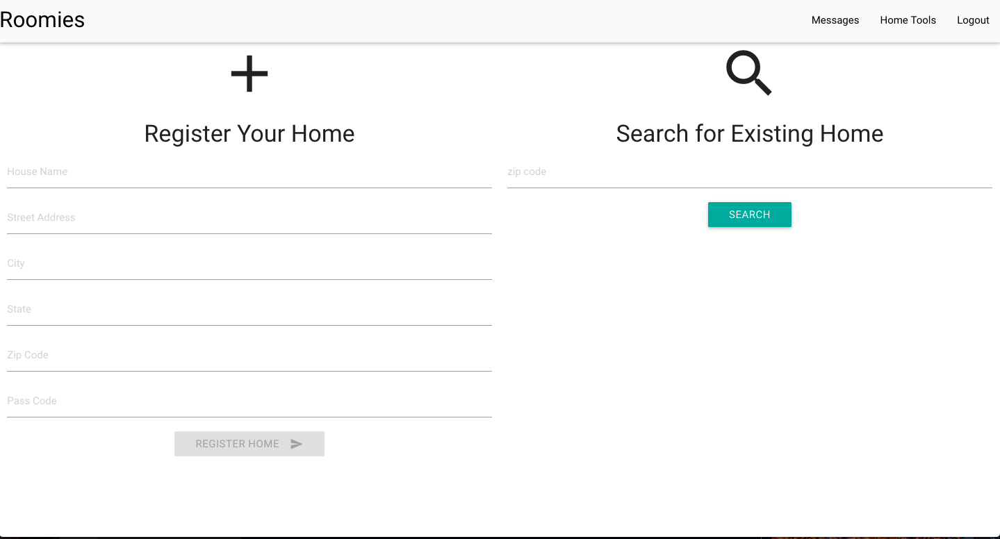
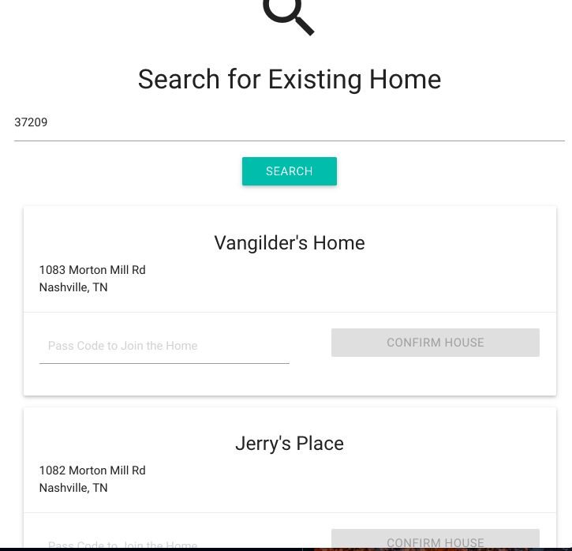
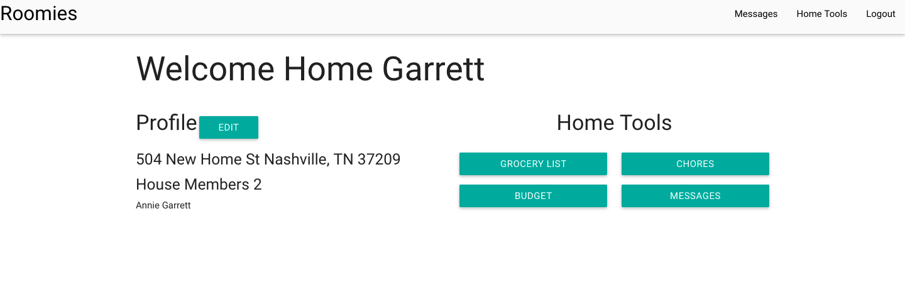
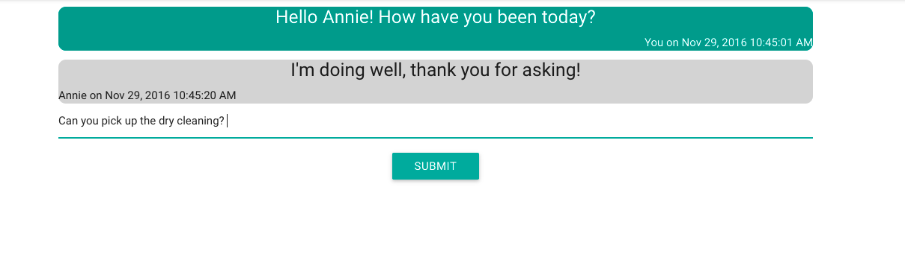
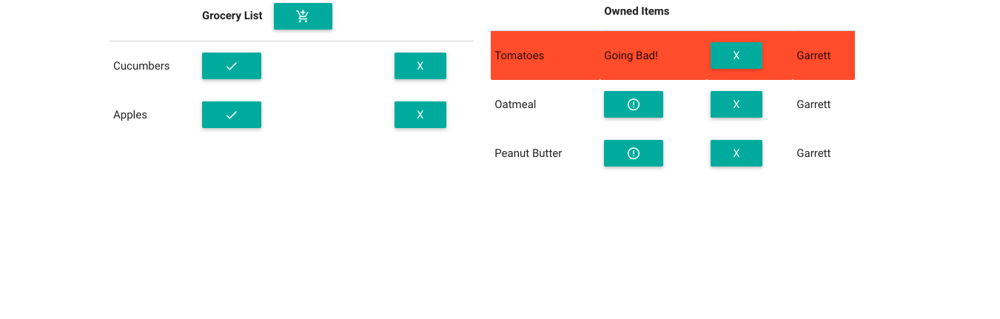
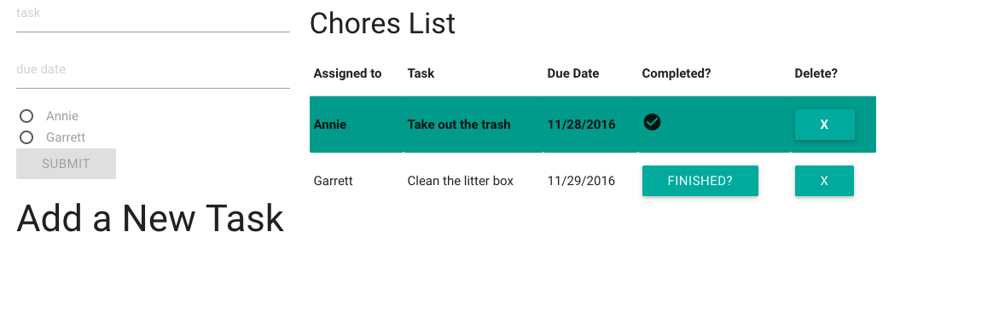
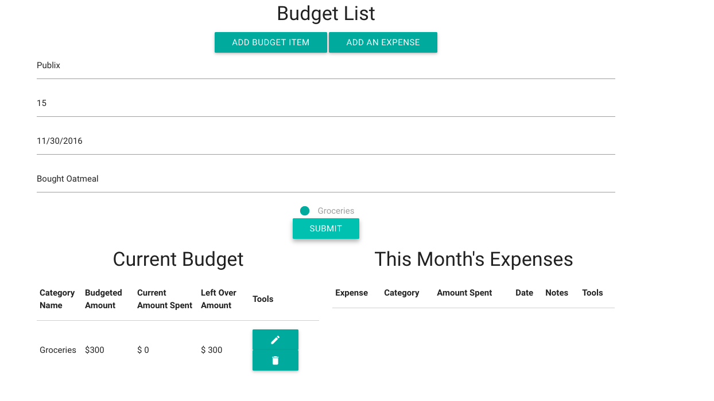
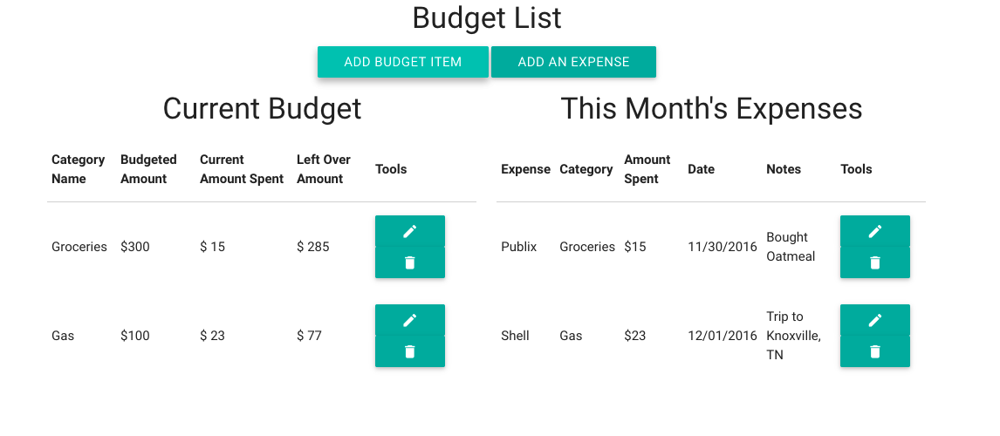

# Roomies (Front-End Capstone Project)

Hosted version here: [Roomies](https://roomies-39f08.firebaseapp.com/#/)

Currently Working on: [Roomies 2.0](https://github.com/garrett-vangilder/roomiesV2)

This application helps facilitate communication between roommates, allowing for roommates to organize groceries, bills, and events. 

## Technologies 

Angular 1.x | FireBase | SASS | Bower | NPM | Grunt 

## Walkthrough

This Walkthrough will display all the functionality of the application. 

### Login

This application allows for users to create accounts, all user information is saved to Firebase, this ensures security as Firebase does encrypt user emails and passwords. The user first views a tasteful splash screen before being able to login to the applciation. 

<kbd></kbd>

### Register

This application does allow for users to register for the application as well. When registering for Roomies the user is asked to provide personal information. The email address and password will be encrpyted upon completing the form. Other information is not encrypted. 

<kbd></kbd>

### Register Home 

Once the user registers, they will then be directed to a register home screen. At this point the user may either register a new home, or they may search for a pre-exisiting home to select.

<kbd></kbd>

### Search for Home 

If the user decided to search for their home through the search field, they must first enter in the desired postal code. Once the user confirms the postal code a list of homes will be displayed. These homes are password protected. Users choose the password for the home when registering the home with the application.

<kbd></kbd>

### Home

Once the user is completely registered for the application they are taken to the home view. The home screen is where the user is allowed to select from a various set of tasks that they would like to complete. 

 <kbd></kbd>

 ### Chat

 One of the features of this application is the ability to communicate with other members of your home. Users may chat to their roommates through the chat feature. Each message is time stamped and color coded for the user.

 <kbd></kbd>

 ### Grocery List

 Another feature of this application allows for users to share a grocery list. Through the grocery list you can set several different states for each item such as: neet to buy, bought, and going bad. You can also delete add and edit items added to the grocery list or purchased list. 

  <kbd></kbd>

 ### Chores List

 Roomies allows for users to add to a home chore list. This chore list allows users to assign different tasks to roommates. Once again there are several different states given to each chore and users are able to edit, delete and complete chores.

  <kbd></kbd>

  ### Adding a Budget item

   Users can also create budget items for the home, where each user can communicate items purchased, bills paid, and expenses for the home.

  <kbd></kbd>
  <kbd></kbd>

